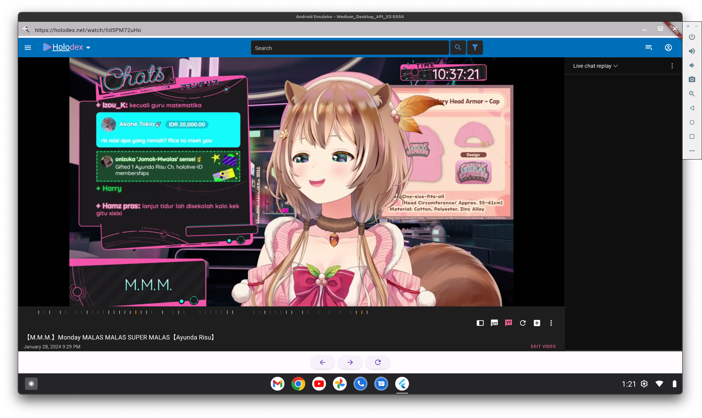

# holodex_plus_flutter

A POC Flutter app for porting [Holodex Plus](https://github.com/HolodexNet/Holodex-Plus) to iOS and Android. This app is
not affiliated with Holodex or Holodex Plus.

## Status

- Enabled Archive Chat boolean flag
- iOS: Videos will not load when using `shouldInterceptFetchRequest`, see [issue](https://github.com/pichillilorenzo/flutter_inappwebview/issues/2001)
- Android: Archive Chat frame is successfully embedded but there are no chat messages, likely due to the
  incomplete extension port I did. See below image:

## Getting Started

This project is a starting point for a Flutter application.

A few resources to get you started if this is your first Flutter project:

- [Lab: Write your first Flutter app](https://docs.flutter.dev/get-started/codelab)
- [Cookbook: Useful Flutter samples](https://docs.flutter.dev/cookbook)

For help getting started with Flutter development, view the
[online documentation](https://docs.flutter.dev/), which offers tutorials,
samples, guidance on mobile development, and a full API reference.

## Resources

- [masterchat](https://github.com/sigvt/masterchat)
- [Holodex Plus](https://github.com/HolodexNet/Holodex-Plus)
- [flutter_inappwebview](https://pub.dev/packages/flutter_inappwebview)
